# BMCU 370C Installation Guide

## Important Safety Notes

!!! danger "WARNING - Prevent PCB Burn Out!"

    1. **Do not plug or unplug any connection wires on the printed circuit board when the printer is turned on.**
    2. **Do not touch the circuit board while it's powered on.** (Static electricity will short-circuit the printed circuit board, causing the mainboard light to turn red.)
    3. **Do not insert the connecting wire into the burn-in port**, as this will cause the motherboard to burn!
    4. **Do not connect the printer terminals in the wrong direction.**

<!-- Image placeholder: Safety warnings illustration -->
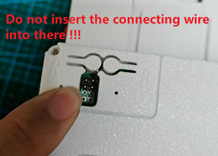

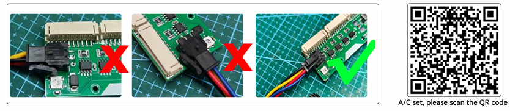

## Compatibility

!!! note
    Need to use **1.05 firmware**, not 1.06 firmware

## Installation Steps

### **Step 1**: Prepare Components

When the goods are delivered, there will be a host and connecting line.

<!-- Image placeholder: Step 1 - Components overview -->
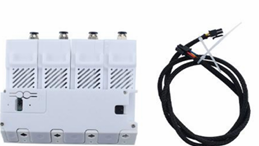

### **Step 2**: Locate Printer Interface

The arrow indicates the interface for connecting the printer.

<!-- Image placeholder: Step 2 - Printer interface location -->
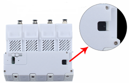

### **Step 3**: Anti-Drop Buckle on 4P Seat

There is an anti-drop buckle on the 4p seat.

<!-- Image placeholder: Step 3 - 4P seat anti-drop buckle -->
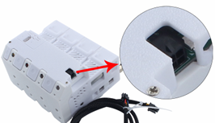

### **Step 4**: Anti-Drop Buckle on Connecting Line

There is also an anti-drop buckle on the connecting line.

<!-- Image placeholder: Step 4 - Connecting line anti-drop buckle -->
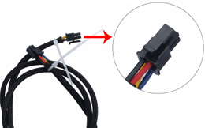

### **Step 5**: Insert Buckle

Insert the corresponding buckle into the buckle, and the BMCU connection is completed.

<!-- Image placeholder: Step 5 - Inserting buckle -->
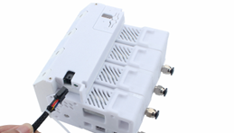

### **Step 6**: Power Off Printer

Before connecting the printer, please note that the printer needs to be turned off.

<!-- Image placeholder: Step 6 - Power off printer -->
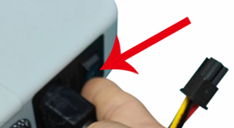

### **Step 7**: Insert Printer Clip

Insert the printer into the corresponding clip.

!!! warning
    If you insert it incorrectly, it will not fit.

<!-- Image placeholder: Step 7 - Inserting printer clip -->
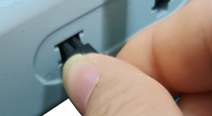

### **Step 8**: Turn On Power

After confirming that the insertion is correct, then you can turn on the power.

<!-- Image placeholder: Step 8 - Turning on power -->
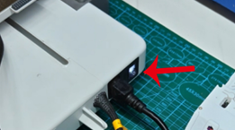

### **Step 9**: Verify Connection

At this time, the BMCU mainboard status is displayed in blue, indicating that the connection is right.

<!-- Image placeholder: Step 9 - Blue LED verification -->
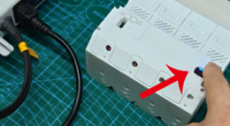

## Related Documentation

- [LED Status Guide](./LED_Status_Guide.md)
- [BMCU Burning Tutorial(UART)](./BMCU_Burning_Tutorial(UART).md)
- [Base Bracket STL](./Downloads/Base_Bracket_Print.md)
