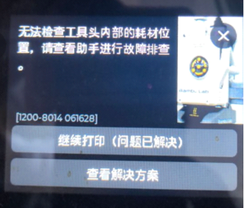
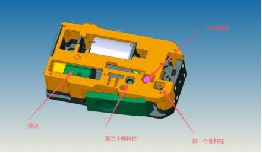
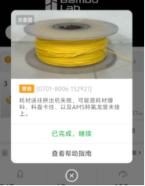
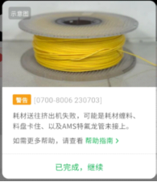
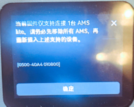
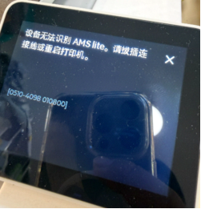

# BMCU Assembly Issues

Please carefully check the pictures and install the unit together with the video tutorial. The following instructions apply only to the factory default firmware (BMCU020 firmware). Because the factory firmware (020) does not have filament memory, please make sure that there is no filament inside the five-way connector before powering on the printer. Otherwise, when the printer feeds filament, it will display a message saying that the filament position cannot be detected.

BMCU Component Diagram:

## 1. Motor Reversal

**Common fault:**

When self-feeding, the motor runs in reverse. This problem is common for beginners. It often happens after only one channel has been assembled and tested on the printer, and then problems appear when the other channels are added. The essential cause is that, when the mainboard powers on, it cannot detect the rotation direction of the radial magnets in the other channels. Therefore, the mainboard randomly assigns the motor direction, which causes the problem.

**Treatment:** reactivate the self-check function of the mainboard. There are two activation methods:

1) Re-flash the firmware. Make sure all channels are connected to the mainboard. After powering on, the direction should return to normal.

2) Activate the self-check program of the original firmware. Remove all daughterboards, power on the empty mainboard, wait until the printer recognizes the AMS, then power off. Reconnect the daughterboards and power on again. The direction should return to normal.

If the fault still remains after the above methods, please check whether the radial magnet is installed in place.

## 2. Slider Magnet Installed in Reverse

This is also one of the common problems. It is purely a detail issue. Please refer to the video and reassemble it.

The magnet should be installed with the south pole facing the filament outlet. If you cannot determine the magnetic pole direction, press the slider: it should show a blue light. Pull up the slider: it should show a red light. If not, reverse the magnet direction.

This fault is often believed to be related to the motor direction, but that understanding is incorrect.

## 3. Filament Break Detection Post Problem (unable to self-feed; automatic color change or automatic filament continuation fails)

(For the position of the filament break detection post, please refer to the component diagram.)

The fault principle is that the microswitch is not triggered normally. Troubleshooting should be carried out around the microswitch.

**1) Unable to self-feed:** First check whether the mainboard microswitch works normally. For the original channel that has already been powered on, directly remove two screws and press the first microswitch. The motor should rotate normally, and the daughterboard light should turn yellow. Then press the second microswitch at the same time. After 1 second, the motor should stop rotating and the filament light should turn on. At this point, the microswitch is normal.

After confirming that the microswitch is normal, use the following method to determine which filament break detection post has a problem. Judge by the light status. Before inserting filament, first observe the light. If the status light turns yellow, the first microswitch has been triggered early, which means the first filament break detection post is too long. If the light is blue, the second microswitch has been triggered, which means the second filament break detection post is too long. If the filament light turns on, both microswitches have been triggered at the same time, meaning both posts are too long. If there is no light after inserting filament, then neither microswitch is triggered, meaning both filament break detection posts are too short. Adjust the post length by increasing or shortening it according to the above judgment.

**2) Unable to unload filament normally, continue filament normally, or change color normally:** this is currently the most common problem after the printer has been assembled and tested on the machine.

The cause is that the second filament break detection post is not long enough, which leads to filament loss detection. The treatment is very simple: lengthen the second filament break detection post. This fault is also related to the filament diameter. Please use filament below the standard diameter with caution.

## 4. Radial Magnet Installation Problem

(For the position of the radial magnet, please refer to the component diagram.)

This problem can cause very serious faults. The related faults include the following:

1) Motor direction judgment. The motor direction is determined according to the rotation of the radial magnet.

2) Unable to unload filament normally, continue filament normally, or change color normally.

**Treatment:** Please check the model hole position and make sure that the magnet can rotate normally and is not stuck. Please download the BMG helper tool for installation.

## 5. Filament Stuck in the Five-Way Connector

This type of fault is often believed to be a BMCU problem, but this is the biggest misunderstanding about the BMCU.

Related fault prompts include: the printer cannot feed filament, the PTFE tube falls off, etc.

When the printer is feeding filament, including feeding during filament change and feeding during filament continuation, judge whether the filament is stuck in the five-way connector as follows: if the BMCU buffer reaches the end position but the Hall sensor inside the extruder is not triggered, then the filament is stuck in the five-way connector. The filament is stuck in the gap of the five-way connector.

**Treatment:** Pull out the tube from the corresponding feed inlet and check whether it is cut flat and pressed all the way in. If everything looks normal, the problem may be the metal clip inside the five-way connector that holds the PTFE tube. Please refer to the Wiki for treatment: AMS lite five-way connector assembly / guide for repairing the tube expansion port that cannot fix the tube | Bambu Lab Wiki.

## 6. Firmware Mismatch

**Treatment:** If the BMCU firmware is the factory firmware (020), please downgrade the A1 printer firmware to 1.04. If the BMCU firmware is the Polish 10.5 version, please upgrade the A1 firmware to 1.07.02 and set it to AMS mode. P1 firmware should be 1.08.
